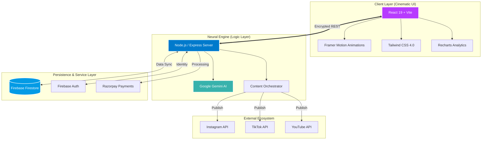

<div align="center">

# 🚀 HyprTags: Go Viral on Autopilot

**The Elite Content Protocol for Instagram, TikTok & YouTube Creators.**

[](https://vitejs.dev/)
[](https://reactjs.org/)
[](https://firebase.google.com/)
[](https://tailwindcss.com/)
[](https://www.typescriptlang.org/)

---

### *“Stop guessing the algorithm. Start triggering it.”*

HyprTags is a high-performance content engine designed to deconstruct virality. By leveraging advanced AI protocols, it transforms simple ideas into high-reach content through viral DNA extraction, smart scheduling, and multi-platform orchestration.

[**Launch Interface**](https://hypr-tag.vercel.app) • [**Explore Features**](#-core-capabilities) • [**View Protocol**](#-technical-architecture)

</div>

---

## ⚡ Core Capabilities

> [!IMPORTANT]
> **HyprTags isn't just a tool; it's a growth ecosystem.** We've engineered every feature to minimize friction and maximize reach.

- **🧬 Viral DNA Extraction**: Deep analysis of trending patterns to generate hooks that stop the scroll.
- **🎥 Neural Video Generator**: AI-powered video synthesis for high-engagement short-form content.
- **🛡️ NeuralGuard™ Protection**: Advanced security and compliance layer for enterprise-grade creators.
- **📊 Real-time Growth Forecast**: Predictive analytics using `Recharts` to visualize your trajectory.
- **🤖 Workflow Automations**: Set your growth on autopilot with intelligent multi-platform posting.
- **🕵️ Competitor Infiltration**: Analyze and adapt strategies from the top 1% of creators in your niche.

---

## 🛠️ Technical Architecture

HyprTags is built on a high-concurrency, scalable stack designed for the modern web.



### **The Frontend (Cinematic Interface)**
- **Framework**: React 19 + Vite
- **Animations**: `Framer Motion` (Motion/React) for elite-tier transitions.
- **Styling**: Tailwind CSS 4.0 with custom glassmorphism tokens.
- **Data Viz**: `Recharts` for high-fidelity analytics.

### **The Backend (Neural Engine)**
- **Runtime**: Node.js + Express
- **AI Engine**: Google Gemini AI (`@google/genai`)
- **Database**: Firebase (Firestore + Authentication)
- **Payments**: Razorpay Integration
- **Deployment**: Vercel Edge Functions

---

## 🚀 Getting Started

To deploy the HyprTags environment locally, follow the protocol below:

### 1. Initialize Environment
```bash
git clone https://github.com/dhruvshah464/HyprTag.git
cd HyprTag
npm install
```

### 2. Configure Credentials
Create a `.env` file in the root directory and populate it with your restricted keys:
```env
GEMINI_API_KEY=your_high_level_key
FIREBASE_CONFIG=your_firebase_payload
RAZORPAY_KEY=your_payment_gateway_id
```

### 3. Boot System
```bash
npm run dev
```
> The local development server will spin up at `http://localhost:5173`.

---

## 💎 Elite Tiers

| Feature | Trial | Starter | Creator Pro |
| :--- | :---: | :---: | :---: |
| Viral Captions | 10 | Unlimited | Unlimited |
| Smart Posting | Basic | Advanced | Predictive |
| Competitor Stealing | ❌ | ❌ | ✅ |
| Multi-Platform | ❌ | ✅ | ✅ |
| Support | Community | Email | High-Priority |

---

<div align="center">

### **Join the 1% of Creators.**
*Engineered by Antigravity // Outcome Over Output*

[Back to Top](#-hyprtags-go-viral-on-autopilot)

</div>
